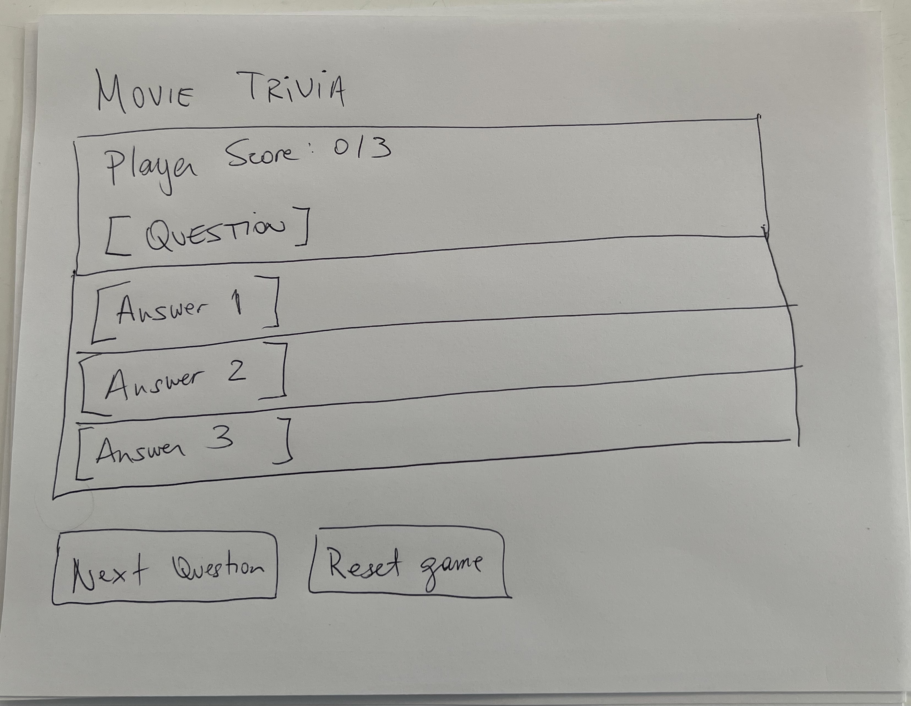

Wireframe:

Game link:

Preview:
This is movie trivia game. A question is made, the player clicks on one of the answers and if it's correct the box gets highlighted in green, and if it's incorrect the box gets highlighted in red. There is a score counter which keeps track of all of the correct answers.

Technology used:
I used javascript, css and html.

Approach:
The main approach to the game was to create an array which would contain objects with the questions and the answers. Using a 'counter' botton linked to the "Next question" button I was able to use the number of the counter to display the number of the respectiva question in a specific array. 
Regarding the sistem to verify correct and incorrect answers I used event listeners that would change the background color of the question to red in case it was incorrect, and to green in case it was correct. Inside each of that event listeners I also included a function would would remove the event listeners of the unclicked box answers.
Finaly, I used the counter variable to keep score of the correct answers. The 'counter++' variable was included in the function inside the event listener linked to the correct answer.

Main features:
Event listeners and functions.
Arrays and Objects.

User Stories:

As a user, I should be able to start playing as soon as the page in loaded.
As a user, I should be able to click on a certain answer and know if it's correct or incorrect.
As a user, I should be able to click onto the next question at any time of the game.
As a user, I should be able to see at all times how many correct questions I have answered.
As a user, I should have the alternative to reset the game and start playing again at all times. 

